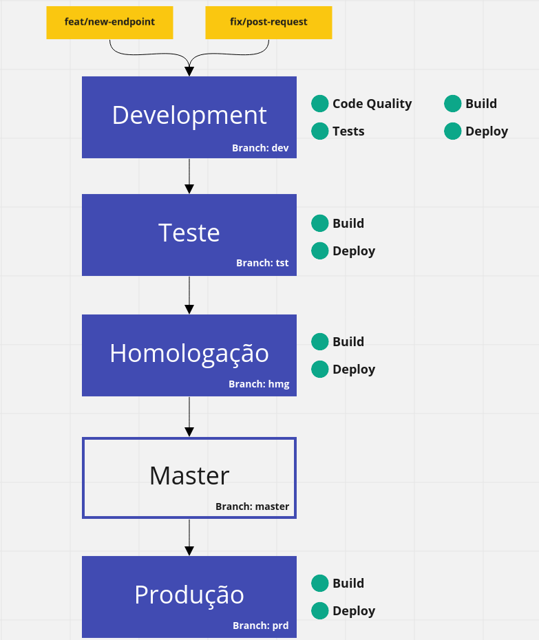

# Aplicação Quarkus Demo

A [aplicação escolhida](https://github.com/quarkusio/quarkus-quickstarts/tree/main/hibernate-reactive-quickstart) foi um pequeno CRUD demo do Quarkus com endpoints REST com algumas adicões.

Embora o código seja surpreendentemente simples, nos bastidores está usando:
  
  - RESTEasy Reactive to expose the REST endpoints
  - Hibernate Reactive to perform the CRUD operations on the database
  - A PostgreSQL database; see below to run one via Docker
  - ArC, the CDI inspired dependency injection tool with zero overhead

As adições realizadas foram o Smallrye Health que implementa a especificação MicroProfile Health, disponibilizando endpoints para serem utilizados no livenessProbe e readinessProbe do Kubernetes e o Smallrye Openapi para expor a especificação OpenAPI pela interface gráfica amigável do Swagger.

## :wrench: Requisitos

Para compilar e executar a aplicação é necessário:

- JDK 1.8+
- GraalVM

## :computer: Comandos necessário durante o desenvolvimento da aplicação
<!-- 
Para iniciar a compilação da aplicação com Maven, execute:

```
./mvnw install
ou
/bin/sh ./mvnw install
``` -->

Para iniciar o desenvolvimento da aplicação com suporte a live coding, execute:

```
./mvnw quarkus:dev
ou
/bin/sh ./mvnw quarkus:dev
```

### Build da aplicação

A duas formas de realizar o build da aplicação, via JVM ou GraalVM. Após o build, para rodar a aplicação será necesário um banco de dados PostgreSQL, para essa dependência execute:

```sh
docker run --ulimit memlock=-1:-1 -it --rm=true --memory-swappiness=0 --name quarkus_test -e POSTGRES_USER=quarkus_test -e POSTGRES_PASSWORD=quarkus_test -e POSTGRES_DB=quarkus_test -p 5432:5432 postgres:11.5
```

#### Compilação utilizando a JVM

Compile a aplicação, executando:

```sh
./mvnw install
ou
/bin/sh ./mvnw install
```

Em seguida inicie a aplicação:

```sh
java -jar ./target/quarkus-app/quarkus-run.jar
```

#### Compilação nativa utilizando a GraalVM

Para a compilação nativa é recomentado a configuração da GraalVM utilizando esse [guia](https://quarkus.io/guides/building-native-image).

Após toda a configuração, compile a aplicação:

```sh
./mvnw install -Dnative
ou
/bin/sh ./mvnw install -Dnative
```

Após a compilação execute o binário diretamente:

```sh
./target/hibernate-reactive-quickstart-1.0.0-SNAPSHOT-runner
```

## :diamond_shape_with_a_dot_inside: CI/CD



Legenda:
  - Quadrado amarelo: Branches temporários que morrem após o pull resquest.
  - Quadrado azul: Branches fixo com pipelines que executaram após qualquer alteração.
  - Quadrado transparente: Branch fixo que terá um release de versão antes de ir para produção.
  - Circulo verde: Jobs da pipeline.

### Job: Build

O job de Build executa o build e push da imagem Docker. A aplicação é compilada de forma nativa com multistage build. [Dockerfile](./Dockerfile.multistage).

### Job: Deploy

O deploy da aplicação é executado via [helm charts](./charts/quarkus-demo/), existe um values com as configurações padrões ([values.yaml](./charts/quarkus-demo/values.yaml)) e um values para cada ambiente. 

## :ballot_box_with_check: Melhorias a serem feitas

- [ ] Melhor organização da execução dos Jobs nas branches. Tirando a branch, todo o resto só tem jobs de build e deploy.
